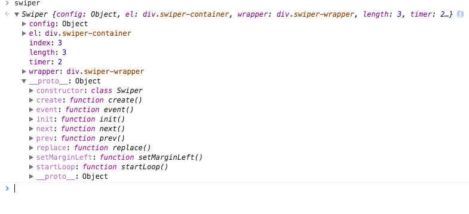

## 常用组件

 * [轮播图](https://daxzhu4096.github.io/component/swiper/index.html) 
 * [日期选择器](https://daxzhu4096.github.io/component/calendar/index.html)
 * [下拉框](https://daxzhu4096.github.io/component/selector/test.html)

## 写一下封装组件的常用套路

轮播图组件是大家重复造的最多的轮子之一了，但对于一个初学者仍然有很好的联系意义。它可以很好的练习js的面向对象编程方式。

### 方法

1. 根据需求在静态页面中写出结构
2. 根据需求写出js代码操作页面结构
3. 根据面向对象的思想，将这套结构和逻辑抽象出来

### 思路

这是借用Swiper的组件html结构：

```html
	<div class="swiper-container">
        <div class="swiper-wrapper">
            <div class="swiper-slide" style="background:red">Slide 1</div>
            <div class="swiper-slide" style="background:yellow">Slide 2</div>
            <div class="swiper-slide" style="background:green">Slide 3</div>
        </div>
        <!-- 如果需要分页器 -->
        <div class="swiper-pagination"></div>

        <!-- 如果需要导航按钮 -->
        <div class="swiper-button-prev"></div>
        <div class="swiper-button-next"></div>
    </div>
```

#### 要求

1. 循环播放
2. 循环中不能出现断层
3. mouseover 循环暂停
4. mouseout 循环恢复
5. 点击分页器按钮画面跳转
6. 点击导航按钮 画面前进或者后退一帧

#### 想法

1. 轮播图并排
2. js调整包裹层的margin达到动态显示各个图片
3. 复制第一个轮播图放入最后
4. 复制最后显示的轮播图放在第一位
5. 设置一个index初始值为1
6. 利用`CSS3`的`transition`属性产生轮播图滑动的动画
7. 设置定时器 index++ 然后渲染 边界替换被复制画面的index 继续渲染
8. 当点击prev按钮的时候 index- -   边界替换被复制画面的index 继续渲染
9. mouseover 清空定时器 mouse out 设定定时器

#### 操作



create方法：复制添加过渡的div、添加控制按钮

event方法：绑定事件

next方法：index++ 执行setMarginLeft方法

prev方法：index- - 执行setMarginLeft方法

setMarginLeft方法：根据 index 设置margin

replace方法：边界处理

startLoop方法：设置定时器

init方法：初始化

length属性：轮播图个数

index：添加过渡后的轮播图数量（从0开始计数）